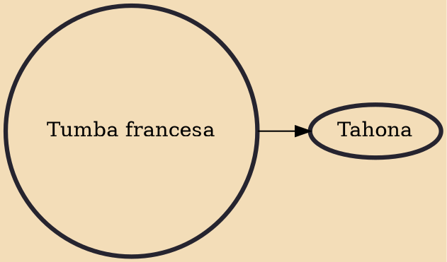

Tumba francesa is a secular Afro-Cuban genre of dance, song, and drumming that emerged in Oriente, Cuba. It was introduced by slaves from the French colony of Saint-Domingue (which would later become the nation of Haiti) whose owners resettled in Cuba's eastern regions following the slave rebellion during the 1790s. The genre flourished in the late 19th century with the establishment of sociedades de tumba francesa (tumba francesa societies), of which only three survive.

## Derivatives
- [[Tahona]]
