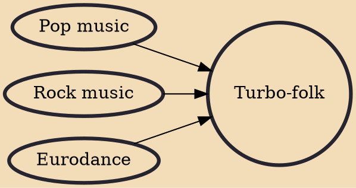

Turbo-folk (sometimes referred as pop-folk or popular folk) is subgenre of contemporary pop music with its origins in Serbia, that initially developed during the 1980s and 1990s, with similar music styles in Bulgaria (chalga), Romania (manele) and Albania (tallava). It is a fusion genre of popular music, blending Serbian folk music with other genres: such as pop, rock, electronic and some hip-hop.

## Influences
- [[Pop music]]
- [[Rock music]]
- [[Eurodance]]
