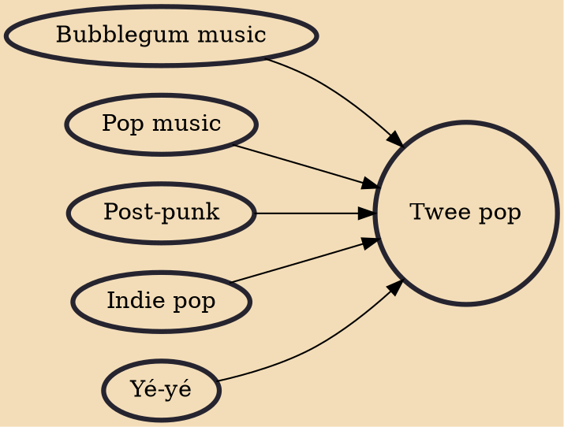

Twee pop is a subgenre of indie pop that originates from the 1986 NME compilation C86. Characterised by its simplicity and perceived innocence, some of its defining features are boy–girl harmonies, catchy melodies, and lyrics about love. For many years, prominent independent record labels associated with twee pop were Sarah Records (in the UK) and K Records (in the US).

## Influences

- [[Bubblegum music]]
- [[Pop music]]
- [[Post-punk]]
- [[Indie pop]]
- [[Yé-yé]]
