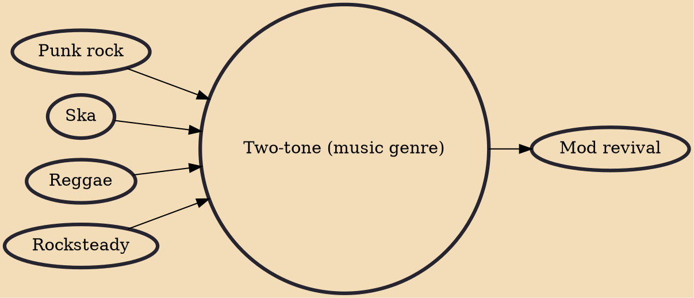

Two-tone or 2 tone is a genre of British popular music of the late 1970s and early 1980s that fused traditional Jamaican ska music with elements of punk rock and new wave music. Its name derives from 2 Tone Records, a record label founded in 1979 by Jerry Dammers of The Specials, and references a desire to transcend and defuse racial tensions in Thatcher-era Britain: many two-tone groups, such as The Specials, The Selecter, and The Beat featured a mix of black, white, and multiracial people.

## Influences
- [[Punk rock]]
- [[Ska]]
- [[Reggae]]
- [[Rocksteady]]

## Derivatives
- [[Mod revival]]
