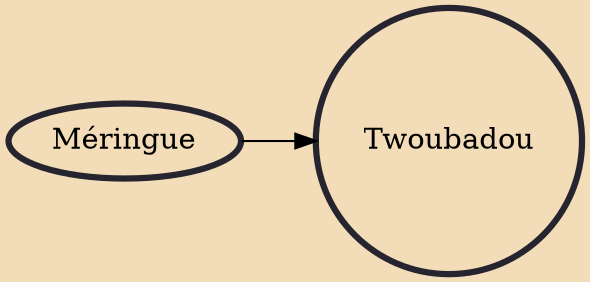

Twoubadou (Haitian Creole pronunciation: [twubadu], French: Troubadour) music is a popular genre of guitar-based music from Haiti that has a long and important place in Haitian culture. The word comes from troubadour, a medieval poet-musician who wrote and sang songs about courtly love. Like the troubadours of old, the Haitian twoubadou is a singer-composer who accompanies himself on songs that tell about the bitterness and humor of love, often using risqué or suggestive lyrics.

## Influences

- [[Méringue]]
