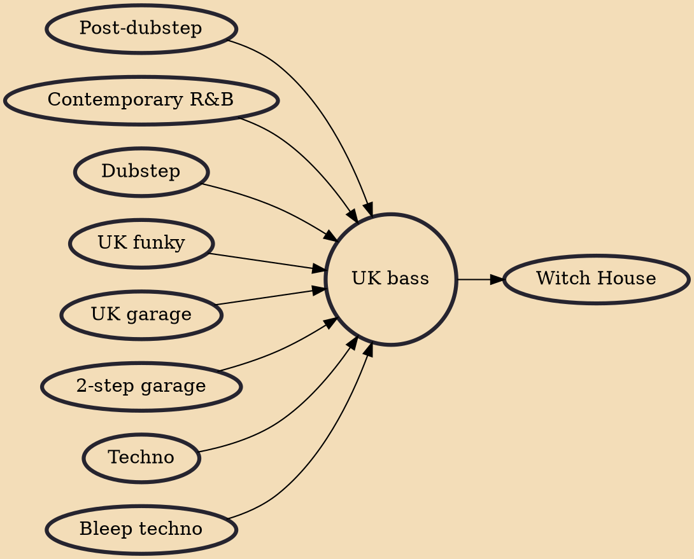

UK bass, also called bass music, is club music that emerged in the United Kingdom during the mid-2000s under the influence of diverse genres such as house, grime, dubstep, UK garage, R&B, and UK funky. The term "UK bass" came into use as artists began ambiguously blending the sounds of these defined genres while maintaining an emphasis on percussive, bass-led rhythm. UK bass is sometimes conflated with bassline or post-dubstep. It is not to be confused with the hip hop and electro-based genre Miami bass, which is sometimes called "bass music" as well.

## Influences
- [[Post-dubstep]]
- [[Contemporary R&B]]
- [[Dubstep]]
- [[UK funky]]
- [[UK garage]]
- [[2-step garage]]
- [[Techno]]
- [[Bleep techno]]

## Derivatives
- [[Witch House]]
