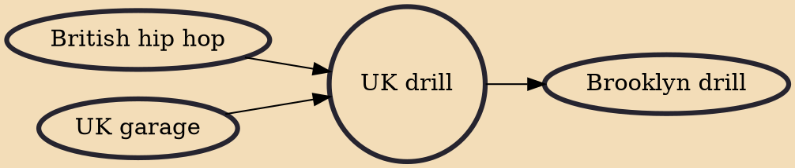

UK drill is a subgenre of drill music and road rap that originated in the South London district of Brixton from 2012 onwards. Initially borrowing heavily from the style of Chicago drill music before creating its own unique sound, UK drill artists often rap about violent and hedonistic criminal lifestyles. Typically, those who create this style of music are affiliated with gangs or come from socioeconomically-deprived neighbourhoods where crime is a way of life for many.

## Influences
- [[British hip hop]]
- [[UK garage]]

## Derivatives
- [[Brooklyn drill]]
