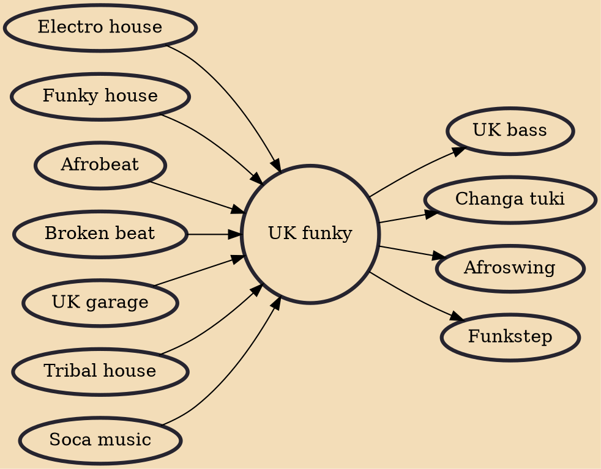

UK funky (sometimes known as UKF or funky) is a genre of electronic dance music born in United Kingdom that is heavily influenced by Soca, soulful house, tribal house, UK garage, broken beat and grime. Typically, UK funky blends beats, bass loops and synths with African and Latin percussion in the dembow rhythm and contemporary R&B-style vocals.

## Influences

- [[Electro house]]
- [[Funky house]]
- [[Afrobeat]]
- [[Broken beat]]
- [[UK garage]]
- [[Tribal house]]
- [[Soca music]]

## Derivatives

- [[UK bass]]
- [[Changa tuki]]
- [[Afroswing]]
- [[Funkstep]]
