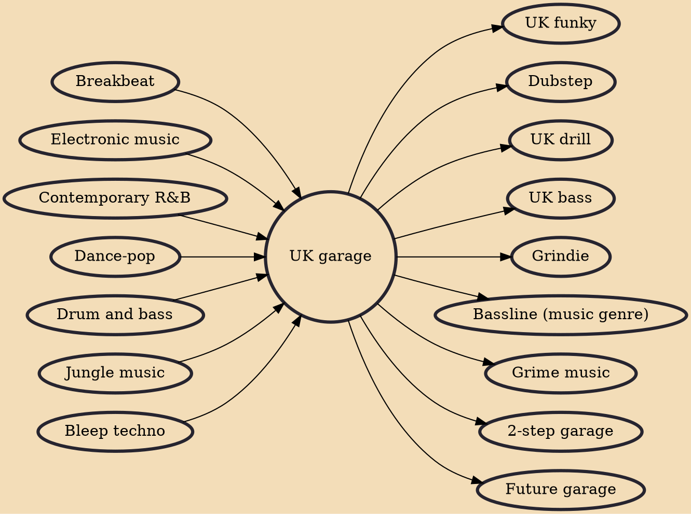

UK garage, abbreviated as UKG, is a genre of electronic dance music which originated in England in the early to mid-1990s. The genre was most clearly inspired by garage house, but also incorporates elements from dance-pop, R&B, and jungle. It is defined by percussive, shuffled rhythms with syncopated hi-hats, cymbals, and snares, and may include either 4/4 house kick patterns or more irregular "2-step" rhythms. Garage tracks also commonly feature 'chopped up' and time-stretched or pitch-shifted vocal samples complementing the underlying rhythmic structure at a tempo usually around 130 BPM.

## Influences
- [[Breakbeat]]
- [[Electronic music]]
- [[Contemporary R&B]]
- [[Dance-pop]]
- [[Drum and bass]]
- [[Jungle music]]
- [[Bleep techno]]

## Derivatives
- [[UK funky]]
- [[Dubstep]]
- [[UK drill]]
- [[UK bass]]
- [[Grindie]]
- [[Bassline (music genre)]]
- [[Grime music]]
- [[2-step garage]]
- [[Future garage]]
