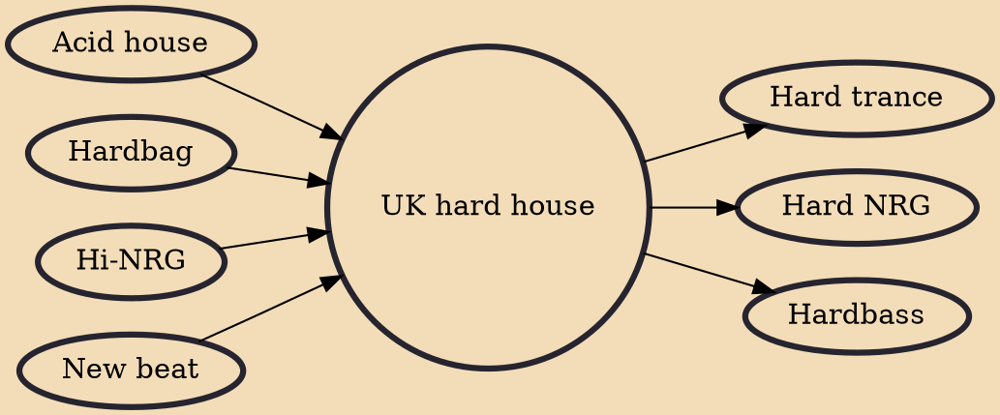

UK hard house or simply hard house is a style of electronic dance music that emerged in the early 1990s and is synonymous with its association to the Trade club and the associated DJs there that created the style. It often features a speedy tempo (around 150 BPM but hard house ranges from around 135 BPM to around 165 BPM), offbeat bass stabs, hoovers and horns. It usually contains a break in the middle of the track where no drums are present. UK hard house often uses a long and sharp string note to create suspense. Most of the time, the drops are introduced by a drum roll.

## Influences
- [[Acid house]]
- [[Hardbag]]
- [[Hi-NRG]]
- [[New beat]]

## Derivatives
- [[Hard trance]]
- [[Hard NRG]]
- [[Hardbass]]
