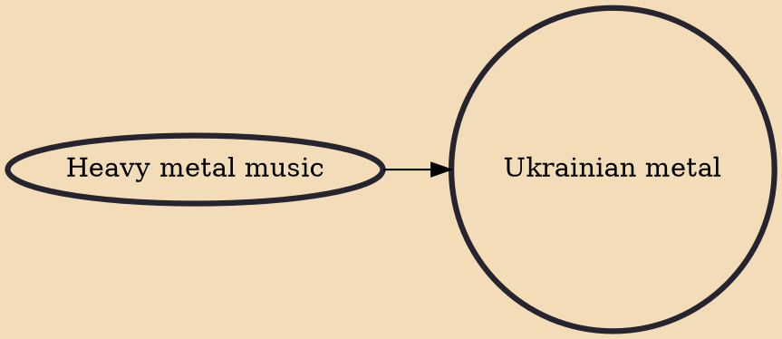

Ukrainian metal is the heavy metal music scene of Ukraine. The most common Ukrainian heavy metal subgenres are black, pagan, folk and death metal. The most popular and well-known bands are black metal bands Drudkh, Nokturnal Mortum, Khors, Kroda, folk metal bands Holy Blood, Tin Sontsia, Veremiy and Kraamola. A metalcore bands Jinjer (founded in 2008) and Space of Variations (founded in 2009) signed a contract with Napalm Records. Stoned Jesus, Motanka, 1914 (founded in 2014) and IGNEA (founded in 2015) are Ukraine's newest metal bands with international notoriety.

## Influences

- [[Heavy metal music]]
