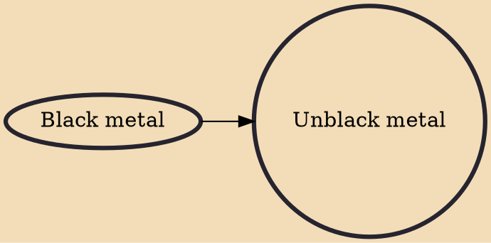

Unblack metal (also known as Christian black metal) is a religious philosophy and subgenre within black metal, inheriting several characteristics of it, such as the melody, the lyrics and the aesthetics (corpse paint), whose artists either directly oppose the Satanism prevalent in most black metal, or promote Christianity in their lyrics and imagery. Unblack metal artists are controversial within the black metal subculture, because black metal's pioneers, especially those of the Second Wave, were anti-Christian. It is also suggested that Christianity contradicts black metal's dark nature and the individualistic and misanthropic ideals of many bands.

## Influences
- [[Black metal]]
