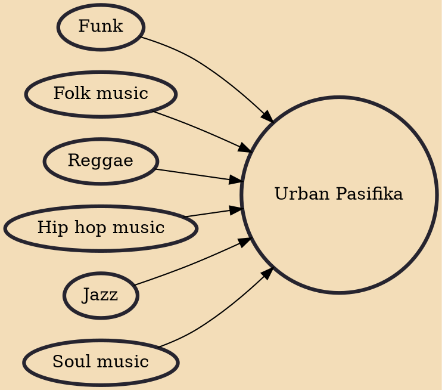

Urban Pasifika (also known as Urban Pacific and Urban Pacifika) is a New Zealand subgenre of hip hop, that developed primarily among Pasifika New Zealanders in South Auckland. Drawn from alternative hip hop and R&B influences, it was quickly blended with Pacific Island or Māori instrumentation and traditional songwriting (such as ukulele samples) and singing and rapping in a variety of Polynesian languages, such as Māori, Samoan, Niuean and Tongan. The genre's genesis in the 1980s blossomed into a unique, globally enrapturing cultural scene in its homeland of Auckland, especially in the next decade. Urban Pasifika is one of the most popular music genres to arise from New Zealand, and helped cement Auckland's reputation on the world stage as a major cultural centre, and the most ethnically

## Influences

- [[Funk]]
- [[Folk music]]
- [[Reggae]]
- [[Hip hop music]]
- [[Jazz]]
- [[Soul music]]
