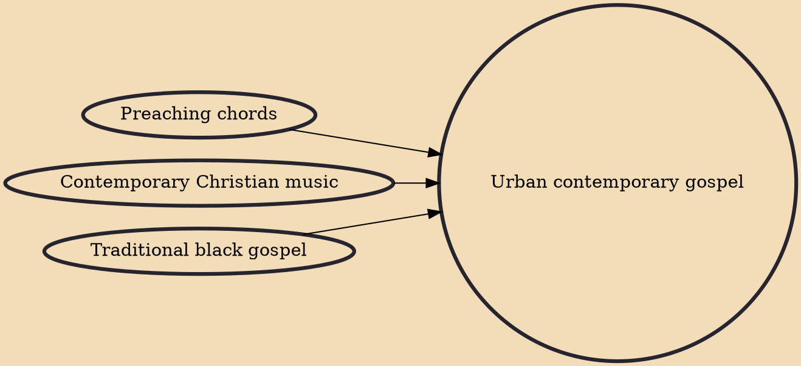

Urban/contemporary gospel is a modern subgenre of gospel music. Although the style developed gradually, early forms are generally dated to the 1970s, and the genre was well established by the end of the 1980s. The radio format is pitched primarily to African-Americans. Christian hip hop can be considered a subtype of this genre.

## Influences

- [[Preaching chords]]
- [[Contemporary Christian music]]
- [[Traditional black gospel]]
