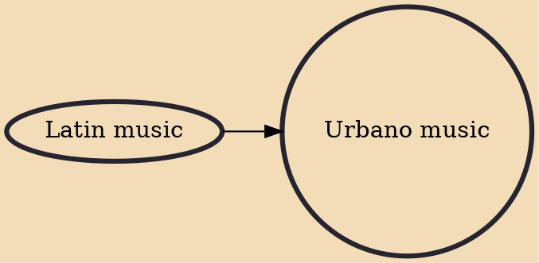

Urbano music (Spanish: música urbana) or Latin urban is a transnational umbrella category including many different genres and styles. As an umbrella term it includes reggaeton, dancehall, dembow, urban champeta, funk carioca and Latin hip hop. The commercial breakthrough of this music took place in 2017. Artists in the style collaborate transnationally, and may originate from the United States including Puerto Rico in particular, Colombia, Cuba, the Dominican Republic, Panama, Venezuela or other Spanish-speaking nations, as well as Portuguese-speaking Brazil.

## Influences
- [[Latin music]]
