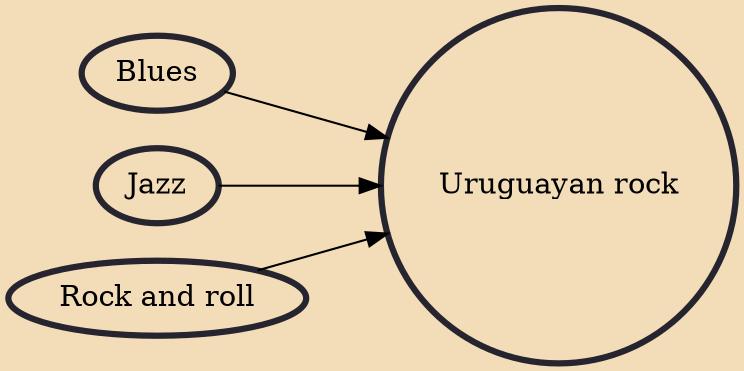

Uruguayan rock first emerged in Uruguay in the 1950s. The real breakthrough for rock in Uruguay, however, as in much of the world, came with the arrival of The Beatles in the early 1960s. Although the country has a small population and is far-removed from the world's cultural centres, rock music from these land, which has always taken on an identity forged from a mix of different cultures (especially, Argentina's and Brazil's, due to proximity) and local peculiarities, crossing different genres and styles, has largely been a well-kept secret outside the region. Thanks to the Internet and easy access to music libraries through streaming services such as Spotify, this is now changing.

## Influences

- [[Blues]]
- [[Jazz]]
- [[Rock and roll]]
