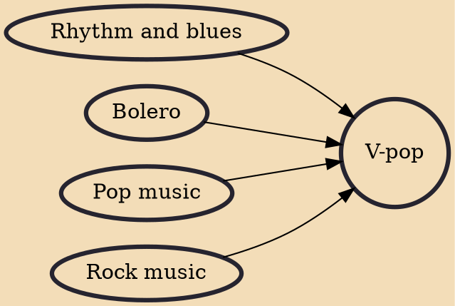

V-pop (Vietnamese: nhạc pop Việt Nam, nhạc trẻ or nhạc xanh), an abbreviation for Vietnamese popular music, is a music genre covering Vietnamese pop music from the 1990s to the present day.

## Influences
- [[Rhythm and blues]]
- [[Bolero]]
- [[Pop music]]
- [[Rock music]]
