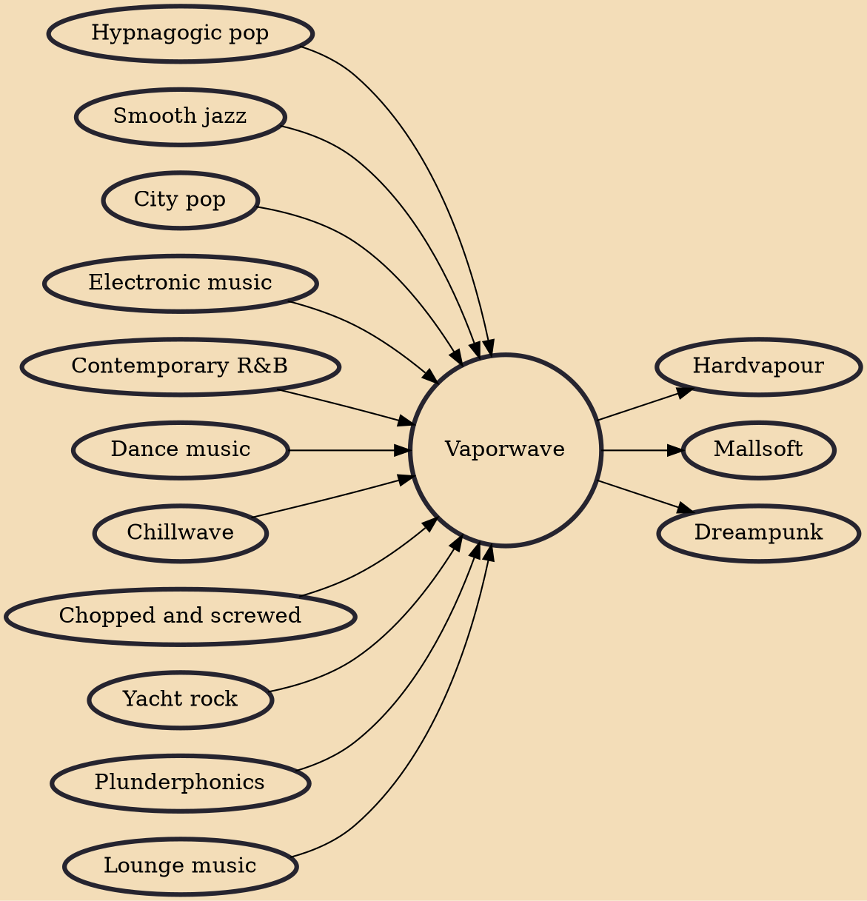

Vaporwave is a microgenre of electronic music, visual art style, and Internet meme that emerged in the early 2010s. It is defined partly by its slowed-down, chopped and screwed samples of smooth jazz, elevator, R&B, and lounge music from the 1980s and 1990s. The surrounding subculture is sometimes associated with an ambiguous or satirical take on consumer capitalism and pop culture, and tends to be characterized by a nostalgic or surrealist engagement with the popular entertainment, technology and advertising of previous decades. Visually, it incorporates early Internet imagery, late 1990s web design, glitch art, anime, 3D-rendered objects, and cyberpunk tropes in its cover artwork and music videos.

## Influences
- [[Hypnagogic pop]]
- [[Smooth jazz]]
- [[City pop]]
- [[Electronic music]]
- [[Contemporary R&B]]
- [[Dance music]]
- [[Chillwave]]
- [[Chopped and screwed]]
- [[Yacht rock]]
- [[Plunderphonics]]
- [[Lounge music]]

## Derivatives
- [[Hardvapour]]
- [[Mallsoft]]
- [[Dreampunk]]
