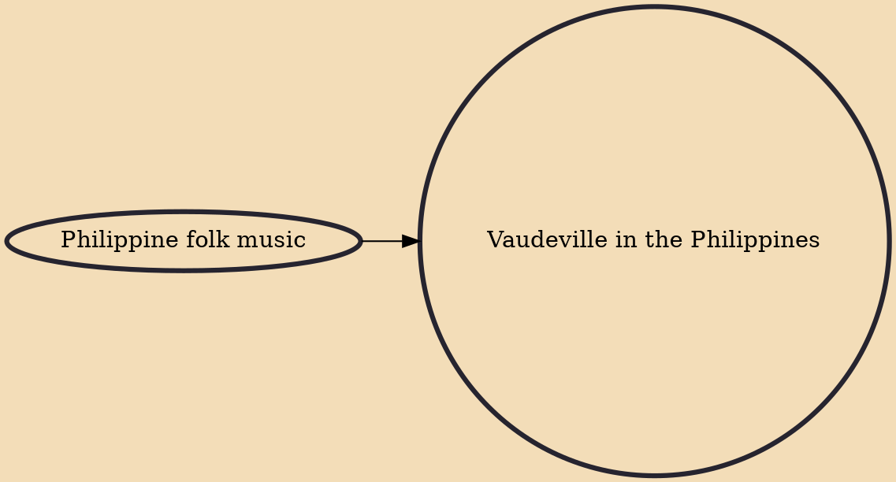

Vaudeville in the Philippines, more commonly referred to as bodabil, was a popular genre of entertainment in the Philippines from the 1910s until the mid-1960s. For decades, it competed with film, radio and television as the dominant form of Filipino mass entertainment. It peaked in popularity during the Japanese occupation in the Philippines from 1941 to 1945. Many of the leading figures of Philippine film in the 20th century, such as Dolphy, Nora Aunor, Leopoldo Salcedo and Rogelio de la Rosa, began their showbusiness careers in bodabil.

## Influences

- [[Philippine folk music]]
