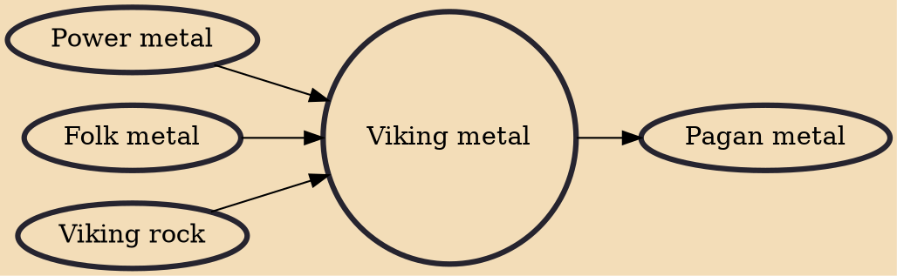

Viking metal is a subgenre of heavy metal music characterized by a lyrical and thematic focus on Norse mythology, Norse paganism, and the Viking Age. Viking metal is quite diverse as a musical style, to the point where some consider it more a cross-genre term than a genre, but it is typically seen as black metal with influences from Nordic folk music. Common traits include a slow-paced and heavy riffing style, anthemic choruses, use of both sung and harsh vocals, a reliance on folk instrumentation, and often the use of keyboards for atmospheric effect.

## Influences
- [[Power metal]]
- [[Folk metal]]
- [[Viking rock]]

## Derivatives
- [[Pagan metal]]
