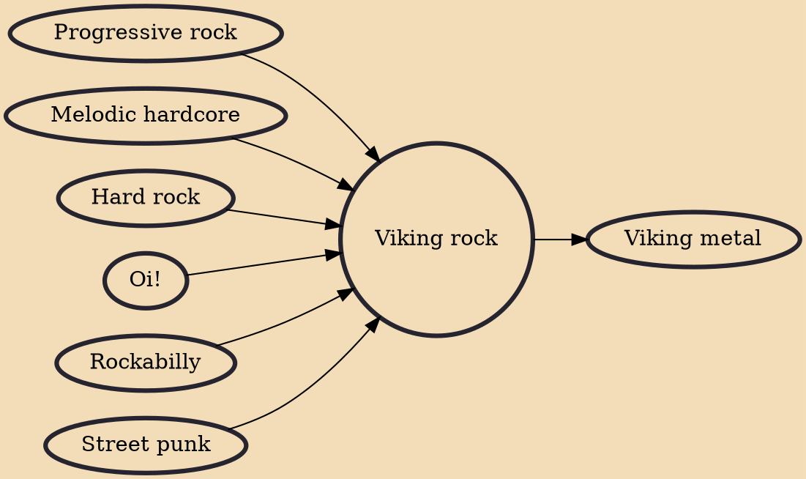

Viking rock (also known as Vikingarock in Swedish) is a rock music genre that takes much of its themes from 19th-century Viking romanticism, mixing it with elements of rockabilly, Oi! or street punk, and folk music. Frequent themes occurring in Viking rock include vikings and Norse mythology, as well as Sweden's King Karl XII and the Caroleans. Kuggnäsfestivalen is a music festival that caters to viking rock.

## Influences

- [[Progressive rock]]
- [[Melodic hardcore]]
- [[Hard rock]]
- [[Oi!]]
- [[Rockabilly]]
- [[Street punk]]

## Derivatives

- [[Viking metal]]
