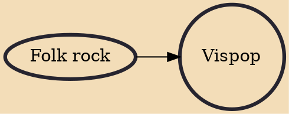

Vispop is a music genre which originated from and became popular in the Scandinavian countries in the mid-1960s. The term is derived from the word visa which denotes traditional and popular folk song of Sweden. In Norway the term applied to this type of accompanied singing is visesang. During the 1970s this was among the most popular genres of music in Scandinavia.

## Influences
- [[Folk rock]]
