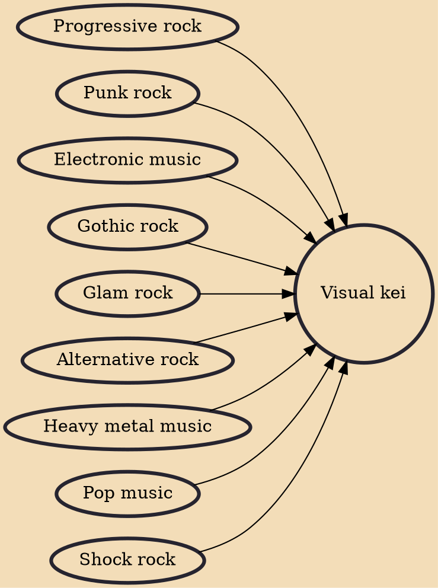

Visual kei (Japanese: ヴィジュアル系 or V系, Hepburn: Vijuaru Kei, lit. "Visual Style") is a movement among Japanese musicians that is characterized by the use of varying levels of make-up, elaborate hair styles and flamboyant costumes, often, but not always, coupled with androgynous aesthetics, similar to Western glam rock.

## Influences

- [[Progressive rock]]
- [[Punk rock]]
- [[Electronic music]]
- [[Gothic rock]]
- [[Glam rock]]
- [[Alternative rock]]
- [[Heavy metal music]]
- [[Pop music]]
- [[Shock rock]]
