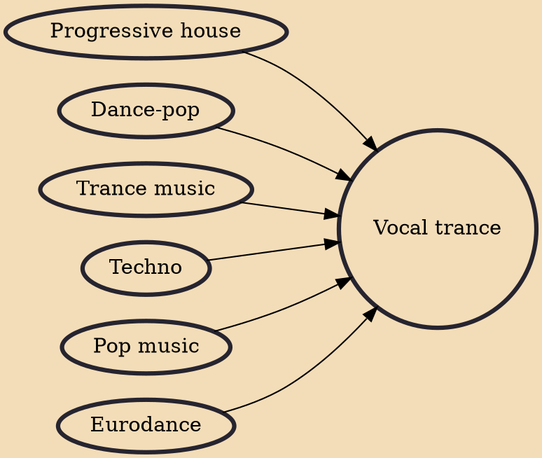

Vocal trance is a subgenre of trance music that focuses on vocals and melodies. The subgenre came into existence in the early 1990s, when trance was still developing. Although many early trance records used vocal samples mixed in with the beats, the earliest examples of the style appeared in 1992–93.

## Influences

- [[Progressive house]]
- [[Dance-pop]]
- [[Trance music]]
- [[Techno]]
- [[Pop music]]
- [[Eurodance]]
