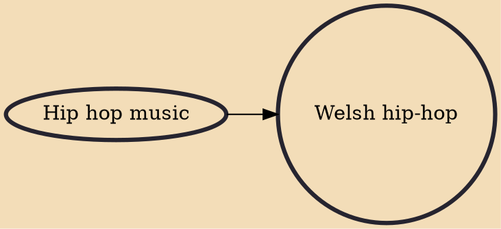

```dot
digraph {
	graph [bgcolor="#F3DDB8" rankdir=LR]
	node [color="#26242F" penwidth=3.0]
	"Welsh hip-hop" [shape=circle]
	"Hip hop music" [URL="/hip-hop-music/"]
	"Hip hop music" -> "Welsh hip-hop"
}
```

Welsh hip-hop (Welsh: Hip-hop Cymru) is a genre of Welsh music, and a culture that covers a variety of styles of hip hop music made in Wales.

## Influences
- [[Hip hop music]]
