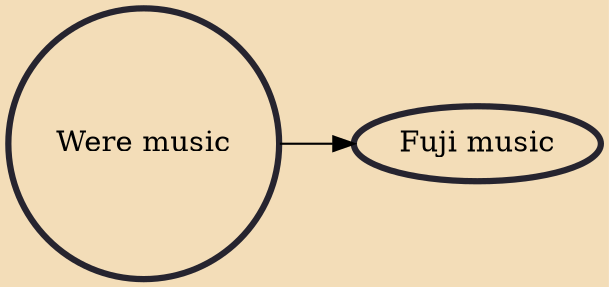

Were music (Yoruba: Wéré) is an indigenous Yoruba music, which, like ajisari, is a way of using music to arouse the Islamic faithful to pray and feast during Ramadan festival in Yorubaland. Ajiwere or oniwere means "one who performs were music." 
* v 
* t 
* e 
* v 
* t 
* e

## Derivatives
- [[Fuji music]]
