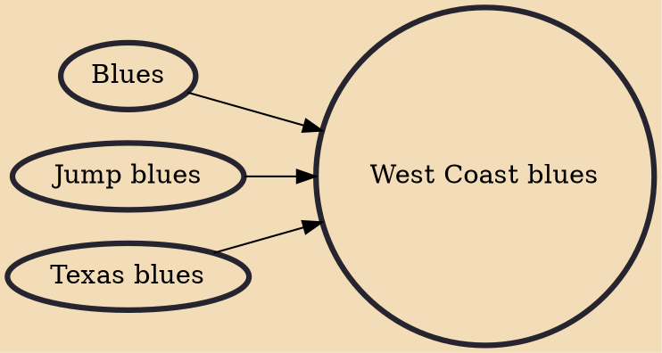

West Coast blues is a type of blues music influenced by jazz and jump blues, with strong piano-dominated sounds and jazzy guitar solos, which originated from Texas blues players who relocated to California in the 1940s. West Coast blues also features smooth, honey-toned vocals, frequently crossing into rhythm and blues territory.

## Influences
- [[Blues]]
- [[Jump blues]]
- [[Texas blues]]
