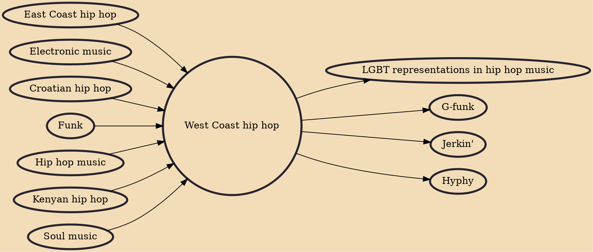

West Coast hip hop is a regional genre of hip hop music that encompasses any artists or music that originated in the West Coast region of the United States. West Coast hip hop began to dominate from a radio play and sales standpoint during the early to-mid 1990s with the birth of G-funk and the emergence of record labels such as Suge Knight and Dr. Dre's Death Row Records, Ice Cube's Lench Mob Records and the continued success of Eazy-E's Ruthless Records, and others.

## Influences
- [[East Coast hip hop]]
- [[Electronic music]]
- [[Croatian hip hop]]
- [[Funk]]
- [[Hip hop music]]
- [[Kenyan hip hop]]
- [[Soul music]]

## Derivatives
- [[LGBT representations in hip hop music]]
- [[G-funk]]
- [[Jerkin']]
- [[Hyphy]]
