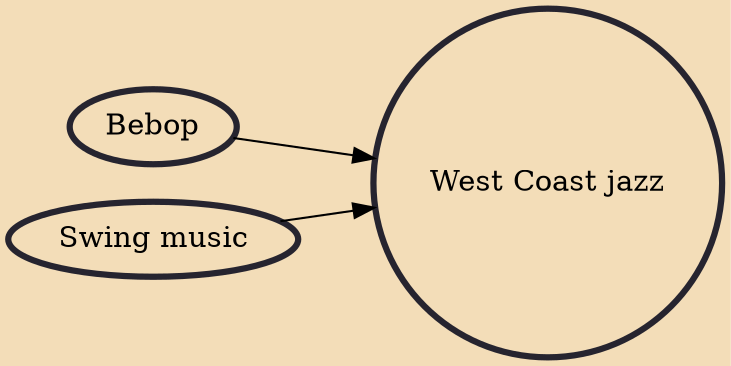

West Coast jazz refers to styles of jazz that developed in Los Angeles and San Francisco during the 1950s. West Coast jazz is often seen as a subgenre of cool jazz, which consisted of a calmer style than bebop or hard bop. The music relied relatively more on composition and arrangement than on the individually improvised playing of other jazz styles. Although this style dominated, it was not the only form of jazz heard on the American West Coast.

## Influences

- [[Bebop]]
- [[Swing music]]
