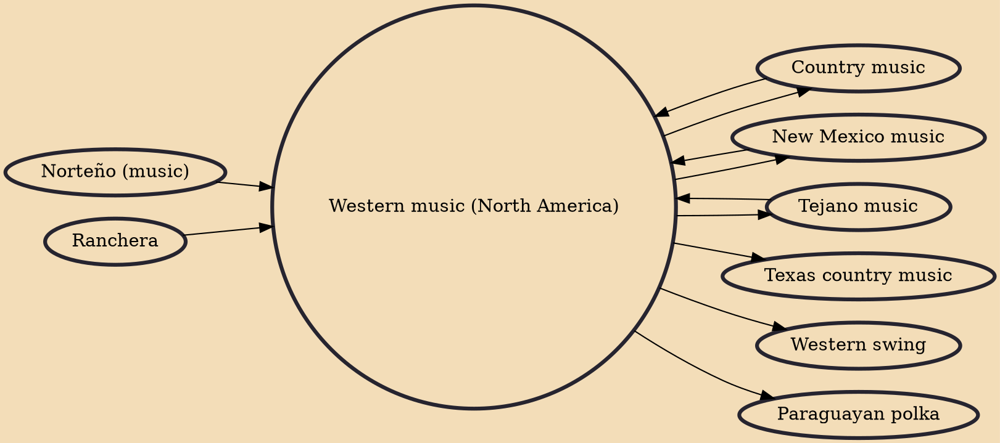

Western music is a form of country music composed by and about the people who settled and worked throughout the Western United States and Western Canada. Western music celebrates the lifestyle of the cowboy on the open ranges, Rocky Mountains, and prairies of Western North America. Directly related musically to old English, Irish, Scottish, and folk ballads, also the Mexican folk music of Northern Mexico and Southwestern United States influenced the development of this genre, particularly corrido, ranchera, New Mexico and Tejano. Western music shares similar roots with Appalachian music (also called country or hillbilly music), which developed around the same time throughout Appalachia and the Appalachian Mountains. The music industry of the mid-20th century grouped the two genres together

## Influences
- [[Norteño (music)]]
- [[Country music]]
- [[New Mexico music]]
- [[Tejano music]]
- [[Ranchera]]

## Derivatives
- [[Country music]]
- [[Texas country music]]
- [[Tejano music]]
- [[New Mexico music]]
- [[Western swing]]
- [[Paraguayan polka]]
