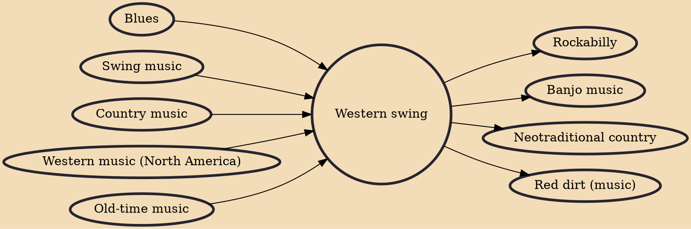

Western swing music is a subgenre of American country music that originated in the late 1920s in the West and South among the region's Western string bands. It is dance music, often with an up-tempo beat, which attracted huge crowds to dance halls and clubs in Texas, Oklahoma and California during the 1930s and 1940s until a federal war-time nightclub tax in 1944 contributed to the genre's decline.

## Influences

- [[Blues]]
- [[Swing music]]
- [[Country music]]
- [[Western music (North America)]]
- [[Old-time music]]

## Derivatives

- [[Rockabilly]]
- [[Banjo music]]
- [[Neotraditional country]]
- [[Red dirt (music)]]
