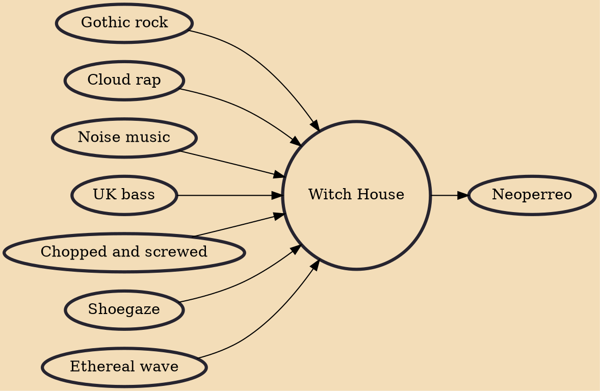

Witch house is a microgenre of electronic music characterized by dark occult themes and visual aesthetics that emerged in the late 2000s and early 2010s. The style is heavily influenced by chopped and screwed hip hop, as well as industrial music, ethereal wave and dream pop. Witch house incorporates synths, drum machines, obscure samples, droning repetition, and vocals that are heavily altered, ethereal, and/or indiscernible.

## Influences

- [[Gothic rock]]
- [[Cloud rap]]
- [[Noise music]]
- [[UK bass]]
- [[Chopped and screwed]]
- [[Shoegaze]]
- [[Ethereal wave]]

## Derivatives

- [[Neoperreo]]
