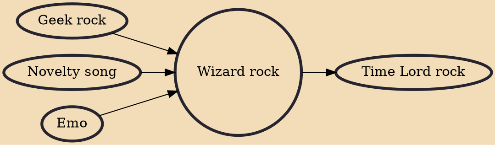

Wizard rock (or Wrock) is a type of novelty rock music themed around the Harry Potter franchise. The music was largely prevalent in the United States in the early 2000s. Wizard rock initially started in Massachusetts with Harry and the Potters, though it has grown internationally.

## Influences

- [[Geek rock]]
- [[Novelty song]]
- [[Emo]]

## Derivatives

- [[Time Lord rock]]
