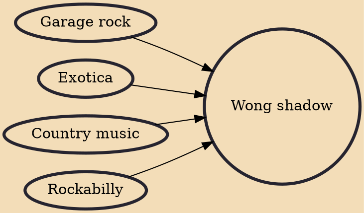

Wong shadow or Shadow Music was a genre of Thai pop music in the early 1960s. It was developed by native Thai musicians inspired by Western groups such as Cliff Richard & the Shadows. Its origins lie in British and American R&B, surf rock artists like The Ventures, Dick Dale, Exotica, rockabilly and country and western brought over by soldiers serving in Vietnam in the late 1950s and early 1960s when on R&R. It also drew heavily on British invasion rock'n'roll, garage rock and Hollywood film soundtracks as well.

## Influences

- [[Garage rock]]
- [[Exotica]]
- [[Country music]]
- [[Rockabilly]]
