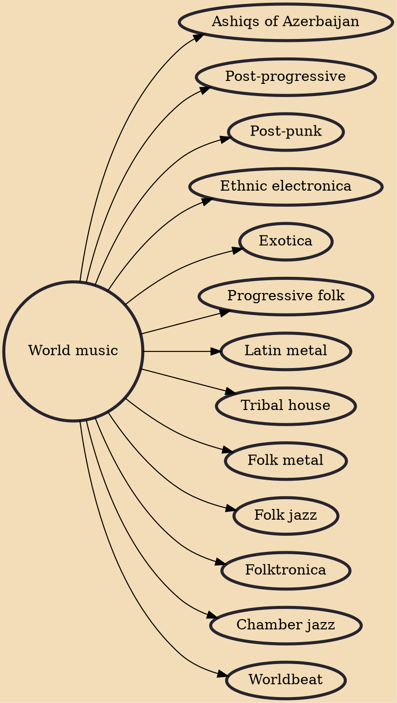

World music is an English phrase for styles of music from non-Western countries, including quasi-traditional, intercultural, and traditional music. World music's inclusive nature and elasticity as a musical category pose obstacles to a universal definition, but its ethic of interest in the culturally exotic is encapsulated in Roots magazine's description of the genre as "local music from out there".

## Derivatives
- [[Ashiqs of Azerbaijan]]
- [[Post-progressive]]
- [[Post-punk]]
- [[Ethnic electronica]]
- [[Exotica]]
- [[Progressive folk]]
- [[Latin metal]]
- [[Tribal house]]
- [[Folk metal]]
- [[Folk jazz]]
- [[Folktronica]]
- [[Chamber jazz]]
- [[Worldbeat]]
