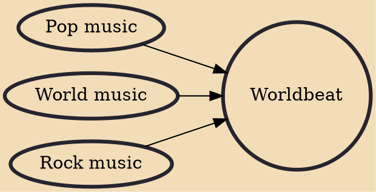

Worldbeat is a music genre that blends pop music or rock music with world music or traditional music. Worldbeat is similar to other cross-pollination labels of contemporary and roots genres, and which suggest a rhythmic, harmonic or textural contrast between its modern and ethnic elements.

## Influences

- [[Pop music]]
- [[World music]]
- [[Rock music]]
