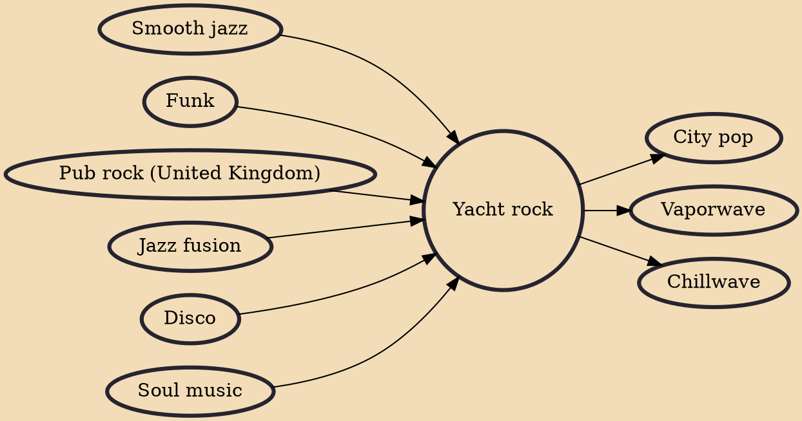

Yacht rock (originally known as the West Coast sound or adult-oriented rock) is a broad music style and aesthetic commonly associated with soft rock, one of the most commercially successful genres from the mid-1970s to the mid-1980s. Drawing on sources such as smooth soul, smooth jazz, R&B, and disco, common stylistic traits include high-quality production, clean vocals, and a focus on light, catchy melodies. Its name, coined in 2005 by the makers of the online video series Yacht Rock, was derived from its association with the popular Southern Californian leisure activity of sailing.

## Influences
- [[Smooth jazz]]
- [[Funk]]
- [[Pub rock (United Kingdom)]]
- [[Jazz fusion]]
- [[Disco]]
- [[Soul music]]

## Derivatives
- [[City pop]]
- [[Vaporwave]]
- [[Chillwave]]
