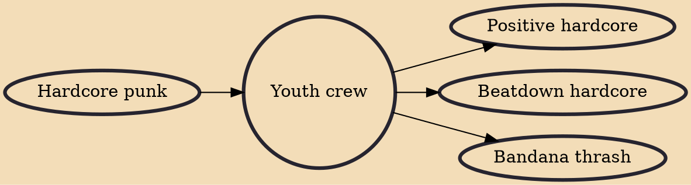

Youth crew is a music subculture of hardcore punk, which was particularly prominent during the New York hardcore scene of the late 1980s. Youth crew is distinguished from other punk styles by its optimism and moralistic outlook. The original youth crew bands and fans were predominantly straight edge (abstaining from alcohol and drugs) and vegetarian or vegan.

## Influences

- [[Hardcore punk]]

## Derivatives

- [[Positive hardcore]]
- [[Beatdown hardcore]]
- [[Bandana thrash]]
