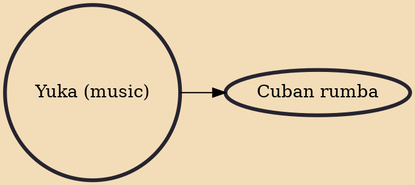

Yuka is a secular Afro-Cuban musical tradition which involves drumming, singing and dancing. It was developed in western Cuba by Kongo slaves during colonial times. Yuka predates other Afro-Cuban genres of dance music like rumba and has survived in Kongo communities of Pinar del Río, specifically in El Guayabo and Barbacoa, San Luis. Since the 1940s, yuka performances have been recorded by researchers such as Harold Courlander and María Teresa Linares.

## Derivatives

- [[Cuban rumba]]
