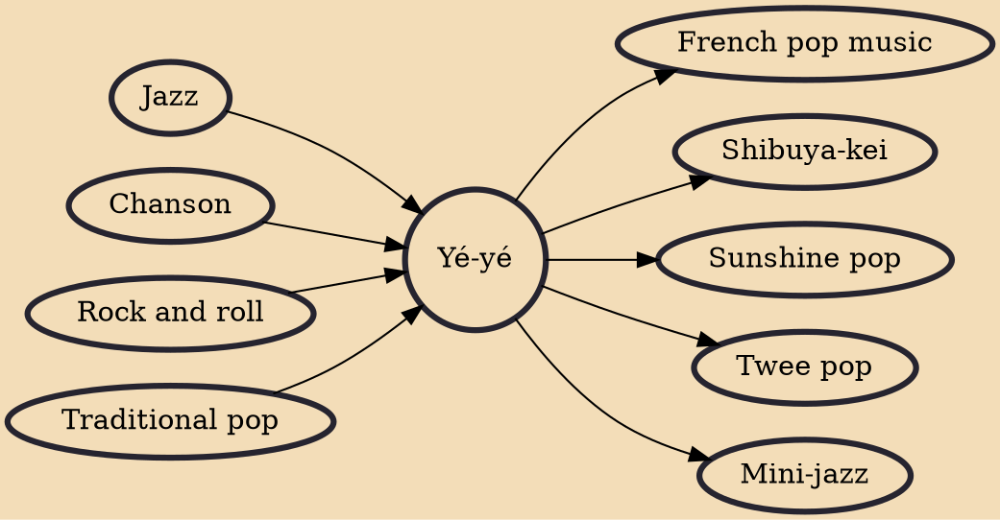

Yé-yé (French pronunciation: ​[je.je]) (yeyé in Spanish) was a style of pop music that emerged in Western-Southern Europe in the early 1960s. The French term "yé-yé" was derived from the English "yeah! yeah!", popularized by British beat music bands such as the Beatles. The style expanded worldwide as the result of the success of figures such as French singer-songwriters Sylvie Vartan, Serge Gainsbourg and Françoise Hardy. Yé-yé was a particular form of counterculture that derived most of its inspiration from British and American rock and roll. Additional stylistic elements of yé-yé song composition include baroque, exotica, pop, jazz and the French chanson.

## Influences
- [[Jazz]]
- [[Chanson]]
- [[Rock and roll]]
- [[Traditional pop]]

## Derivatives
- [[French pop music]]
- [[Shibuya-kei]]
- [[Sunshine pop]]
- [[Twee pop]]
- [[Mini-jazz]]
