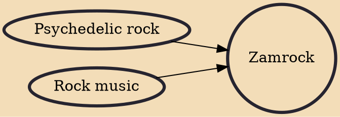

Zamrock is a musical genre that emerged in the 1970s in Zambia. It is described as a combination of traditional African music with psychedelic rock, garage rock, hard rock, blues and funk. Some artists also pulled from acid rock, heavy metal and folk music. It has been described as the combined sound of Jimi Hendrix and James Brown. Many Zamrock bands were also influenced by the heavy repetitive riffs of bands like Black Sabbath, Blue Cheer, the Rolling Stones, Deep Purple, and Cream.

## Influences

- [[Psychedelic rock]]
- [[Rock music]]
