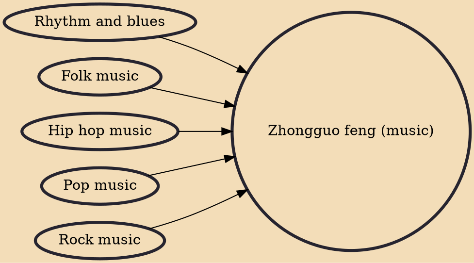

Zhongguo feng or Chinese style (simplified Chinese: 中国风; traditional Chinese: 中國風; pinyin: Zhōngguó fēng) music is a popular Chinese music genre considered to adopt a more traditional musical style in its instrumental than normal popular music, similar to Chinese traditional music but with a "Modern Twist" style way. Following the success of Taiwanese singer Jay Chou's early works including "Wife" (娘子) and "East Wind Breaks" (東風破), it emerged in the popular music scene in early 2000s. The Gufeng music is similar but slightly different from Zhongguo feng music.

## Influences
- [[Rhythm and blues]]
- [[Folk music]]
- [[Hip hop music]]
- [[Pop music]]
- [[Rock music]]
