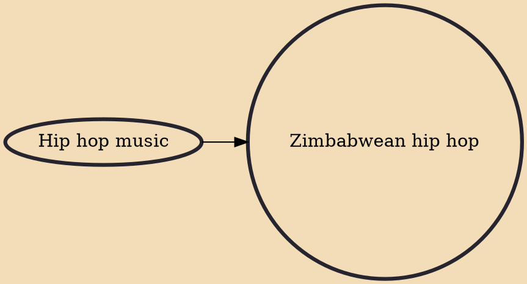

Zimbabwean Hip hop is the variety of hip hop that is popular in Zimbabwe. It emerged in the early 1990s. Prominent artists include Gze, Junior Brown, Calvin,Saintfloew, Holy Ten, Mahcoy, Asaph, Kriss Newtone, Jay You, Suhn, Denim Woods, Grade 1B,RxxThLess_SK., Hanna, Tanto Wavie, Tehn Diamond, Synik, Maskiri, Ex Q, TreyXL, Munetsi, and Raykaz. Trap Music is its most popular subgenre.

## Influences
- [[Hip hop music]]
