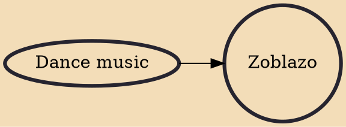

Zoblazo is a musical style from Abidjan, Côte d'Ivoire, created in the early 1990s. It is a cosmopolitan popular dance music with simple up-tempo rhythm and high tech instrumentation and contains a mixture of traditional dance rhythms from southern Côte d'Ivoire.

## Influences

- [[Dance music]]
