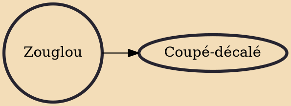

Zouglou (/ˈzuːɡluː/ ZOO-gloo, French: [zuɡlu]) is a dance oriented style of music originated from Ivory Coast during the mid-1990s. It started with students from a college of Gagnoa drawing on elements of other styles of music. Zouglou recounts the various social realities experienced by the Ivorian youth and carries messages, sometimes humorous, sometimes political, or, more often, delivers advice on life. It has since spread elsewhere, including to Burkina Faso, Cameroon and Gabon.

## Derivatives

- [[Coupé-décalé]]
