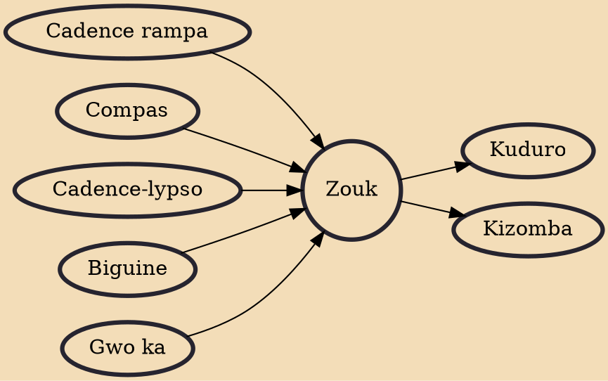

Zouk is a musical movement pioneered by the French Antillean band Kassav' in the early 1980s. It was originally characterized by a fast tempo (120–145 bpm), a percussion-driven rhythm and a loud horn section. The fast zouk béton of Martinique and Guadeloupe faded away during the 1980s. Musicians from Martinique and Guadeloupe added MIDI instrumentation to their compas style, which developed into zouk-love. Zouk-love is effectively the French Lesser Antilles' compas. Zouk gradually became indistinguishable from the genre known as compas. This light compas influenced the Cape-Verdean new generation.

## Influences

- [[Cadence rampa]]
- [[Compas]]
- [[Cadence-lypso]]
- [[Biguine]]
- [[Gwo ka]]

## Derivatives

- [[Kuduro]]
- [[Kizomba]]
