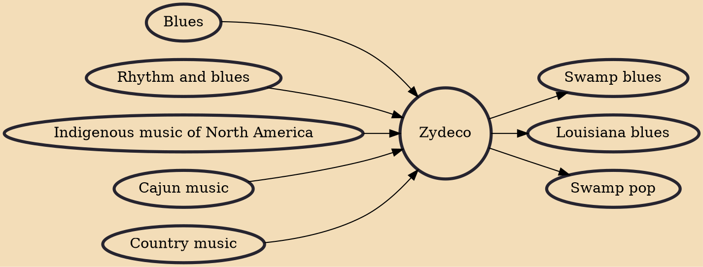

Zydeco (/ˈzaɪdɪˌkoʊ/ ZY-dih-koh or /ˈzaɪdiˌkoʊ/ ZY-dee-koh, French: Zarico) is a music genre that evolved in southwest Louisiana by French Creole speakers which blends blues, rhythm and blues, and music indigenous to the Louisiana Creoles and the Native American people of Louisiana. Although it is distinct in origin from the Cajun music of Louisiana, the two forms influenced each other, forming a complex of genres native to the region.

## Influences

- [[Blues]]
- [[Rhythm and blues]]
- [[Indigenous music of North America]]
- [[Cajun music]]
- [[Country music]]

## Derivatives

- [[Swamp blues]]
- [[Louisiana blues]]
- [[Swamp pop]]
