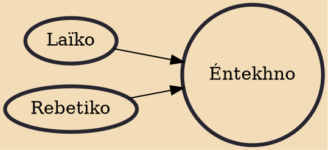

Éntekhno (Greek: έντεχνο, pronounced ['endexno], pl: éntekhna [tragoudia]) is orchestral music with elements from Greek folk rhythm and melody. Its lyrical themes are often based on the work of famous Greek poets. Éntekhno arose in the late 1950s, drawing on rebetiko's westernization by Vassilis Tsitsanis and Manolis Chiotis. Mikis Theodorakis and Manos Hatzidakis were the most popular early composers of éntekhno song cycles.

## Influences
- [[Laïko]]
- [[Rebetiko]]
